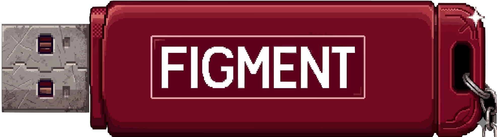

<p align="center">
  
</p>

<h4 align="center">Figmentum es</h4>

<p align="center">
    <a href="https://github.com/trydydd/llmstick/commits/main">
    
    </a>
    <a href="https://github.com/trydydd/llmstick/issues">
    
    </a>
    <a href="https://github.com/trydydd/llmstick/pulls">
    
    </a>
</p>

<p align="center">
  <a href="#quick-start">Quick Start</a> •
  <a href="#requirements">Requirements</a> •
  <a href="#how-it-works">How It Works</a> •
  <a href="#flags--overrides">Flags & Overrides</a> •
  <a href="#file-structure">File Structure</a> •
  <a href="#troubleshooting">Troubleshooting</a> •
  <a href="#tech-stack">Tech Stack</a> •
  <a href="#credits">Credits</a> •
  <a href="#support">Support</a>
</p>

---

<table>
<tr>
<td bgcolor="eaf4e2">

**Figment** is a complete, open-source build for an AI flash drive that runs **fully offline** — no internet, no installation, no accounts. Plug in the drive, run the launcher, and start asking questions. Nothing is ever saved.

It ships a self-contained `llama.cpp` runtime alongside abliterated [Qwen3](https://huggingface.co/prithivMLmods/Qwen3-4B-2507-abliterated-GGUF) models, auto-selects the best model for your available RAM, and falls back cleanly from GPU to CPU when needed.

Everything you need to build your own is right here — the launcher scripts, the builder, and the folder structure.

> This project is derived from and inspired by the original [OSE FACTS project](https://github.com/WEAREOSE/facts). Windows and Mac support has been stripped to reduce scope while new features are in-flight. For those platforms check the original project.

</td>
</tr>
</table>

## Quick Start

##### Build your own drive:

1. Get a USB flash drive (16 GB minimum, 32 GB+ recommended)
2. Clone or download this repo
3. Run the setup script, pointing it at your mounted drive:

   ```bash
   ./BuildYourOwn.sh --target /path/to/usb/mount
   ```

4. Run `LinuxLaunch.sh` from the drive

> [!TIP]
> Run `./BuildYourOwn.sh --help` for the full list of options, including `--format-device` to format the drive as exFAT in one step.

##### Required downloads (fetched automatically by the builder):

| File | Size | Source |
|------|------|--------|
| `llama-<release>-bin-ubuntu-<arch>.tar.gz` | varies | Pinned `ggml-org/llama.cpp` release → `runtime-cpu/` |
| `llama-<release>-bin-ubuntu-vulkan-<arch>.tar.gz` | varies | Pinned accelerated Linux release → `runtime-cuda/` |
| `Qwen3-4B-Instruct-2507-abliterated.Q8_0.gguf` | ~4.0 GB | [HuggingFace](https://huggingface.co/prithivMLmods/Qwen3-4B-2507-abliterated-GGUF/tree/main/Qwen3-4B-Instruct-2507-abliterated-GGUF) |
| `Qwen3-4B-Instruct-2507-abliterated.Q4_K_M.gguf` | ~2.3 GB | [HuggingFace](https://huggingface.co/prithivMLmods/Qwen3-4B-2507-abliterated-GGUF/tree/main/Qwen3-4B-Instruct-2507-abliterated-GGUF) |
| `Qwen3-4B-Thinking-2507-abliterated.Q8_0.gguf` | ~4.0 GB | [HuggingFace](https://huggingface.co/prithivMLmods/Qwen3-4B-2507-abliterated-GGUF/tree/main/Qwen3-4B-Thinking-2507-abliterated-GGUF) |
| `Qwen3-Coder-30B-A3B-Instruct-Q4_K_M.gguf` | ~18 GB | [HuggingFace](https://huggingface.co/unsloth/Qwen3-Coder-30B-A3B-Instruct-GGUF/tree/main) |

> [!NOTE]
> The builder defaults to pinned upstream `llama.cpp` release URLs. Override `LLAMA_CPP_CPU_PACKAGE_URL` / `LLAMA_CPP_CUDA_PACKAGE_URL` to reuse an existing rotorquant-capable fork or custom build.

## Requirements

|                | Minimum                    | Recommended                        |
| -------------- | -------------------------- | ---------------------------------- |
| **RAM**        | 8 GB                       | 16 GB+                             |
| **OS**         | Any modern Linux x86_64 or ARM64 | NVIDIA GPU for acceleration  |
| **Drive**      | USB 2.0                    | USB 3.0 for faster model load times |

## How It Works

1. Plug in the drive
2. Run `LinuxLaunch.sh`
3. The launcher kills any ghost processes from previous sessions
4. All chat history is wiped — **nothing is ever saved**
5. Available RAM is detected and the best model is selected automatically:
   - 16 GB+ → Q8 (high quality)
   - 8–15 GB → Q4 (efficiency mode)
6. GPU is detected and the best runtime package is chosen:
   - `runtime-cuda/` when a CUDA-capable NVIDIA stack is available
   - `runtime-cpu/` otherwise
7. A KV-cache profile is applied:
   - `auto` (default) → equivalent to `memory-saver`; prefer rotorquant `turbo3/f16`; falls back to a supported quantized type if the runtime does not advertise rotorquant cache types
   - `compatibility` → `f16/f16` (safest, works everywhere)
   - `memory-saver` → prefer `turbo3/f16`; falls back to a supported quantized type
   - `max-compression` → prefer `turbo3/turbo3`; falls back to a supported quantized type
8. If the runtime rejects the requested cache profile, the launcher retries automatically with `f16/f16`
9. Model loads into RAM (10–60 seconds)
10. `>` prompt appears — start asking questions

## Flags & Overrides

```bash
./LinuxLaunch.sh --thinking
./LinuxLaunch.sh --coder

FIGMENT_MODEL_PROFILE=auto|thinking|coder ./LinuxLaunch.sh
FIGMENT_KV_PROFILE=auto|compatibility|memory-saver|max-compression ./LinuxLaunch.sh
FIGMENT_KV_ROTATION=turbo3|planar3|iso3 ./LinuxLaunch.sh
FIGMENT_CTX_SIZE=8192 ./LinuxLaunch.sh
```

| Flag / Variable | Effect |
|---|---|
| `--thinking` | Prefers `Qwen3-4B-Thinking-2507-abliterated.Q8_0.gguf`; falls back to the RAM-selected model if missing |
| `--coder` | Prefers `Qwen3-Coder-30B-A3B-Instruct-Q4_K_M.gguf`; falls back to the RAM-selected model if missing |
| `FIGMENT_MODEL_PROFILE=thinking\|coder` | Same as `--thinking` / `--coder` without CLI flags |
| `FIGMENT_KV_PROFILE=compatibility` | Forces `f16/f16` — the safest cache mode |
| `FIGMENT_KV_PROFILE=memory-saver` | Prefers mixed rotorquant profile (`turbo3/f16` by default) |
| `FIGMENT_KV_PROFILE=max-compression` | Prefers smallest rotorquant profile (`turbo3/turbo3` by default) |
| `FIGMENT_KV_ROTATION=planar3\|iso3` | Changes which rotorquant family `memory-saver` and `max-compression` try first |
| `FIGMENT_CTX_SIZE=N` | Overrides the default 8192-token context window |

## File Structure

```
Figment/
├── LinuxLaunch.sh              # Linux launcher
├── BuildYourOwn.sh             # Automated USB builder
├── LICENSES/
│   ├── LLAMA_CPP_LICENSE.txt   # MIT License (llama.cpp)
│   └── MODEL LICENSES/
│       └── QWEN_LICENSE.txt    # Apache 2.0 (Qwen)
└── .system/                    # Hidden folder (populated by builder)
    ├── runtime-cpu/            # CPU llama.cpp package (llama-cli + llama-server)
    ├── runtime-cuda/           # CUDA/Vulkan llama.cpp package
    ├── *.Q8_0.gguf             # High-quality model (~4 GB)
    ├── *Thinking*.Q8_0.gguf    # Optional Thinking model (~4 GB)
    ├── *Coder*.Q4_K_M.gguf     # Optional Coder model (~18 GB)
    └── *.Q4_K_M.gguf           # Efficiency model (~2.3 GB)
```

## Troubleshooting

| Problem | Fix |
|---------|-----|
| "Runtime not found" | Re-run `BuildYourOwn.sh` or manually unpack runtime tarballs into `.system/runtime-cpu` and `.system/runtime-cuda` |
| Hangs on startup | Check `free -m` — need 4 GB+ free. Close browsers and other heavy applications. |
| Slow responses | Normal without a GPU. CPU inference is slower but fully functional. |
| KV profile rejected | Set `FIGMENT_KV_PROFILE=compatibility` and retry |
| AI crashes mid-conversation | Context window full. Close and relaunch. |
| AI refuses to answer | Close and relaunch. Rephrase the question. |

## Tech Stack

| Component | Technology | License |
|-----------|-----------|---------|
| AI Engine | [`llama.cpp`](https://github.com/ggml-org/llama.cpp) rotorquant runtime | MIT |
| Default models | [Qwen3-4B-Instruct abliterated](https://huggingface.co/prithivMLmods/Qwen3-4B-2507-abliterated-GGUF) | Apache 2.0 |
| KV cache profiles | `f16`, `turbo3`, `planar3`, `iso3` (runtime-dependent) | — |
| Context window | 8192 tokens (default, configurable) | — |

> [!NOTE]
> Default runtime packages are pinned to `ggml-org/llama.cpp` release `b8893`. The `runtime-cuda/` slot uses the Vulkan build by default. Override `LLAMA_CPP_CUDA_PACKAGE_URL` to use a CUDA-specific build. Rotorquant reference source: `johndpope/llama-cpp-turboquant` branch `feature/planarquant-kv-cache` commit `20efe75`.

## Credits

Built on the shoulders of the [OSE FACTS project](https://github.com/WEAREOSE/facts), the [llama.cpp](https://github.com/ggml-org/llama.cpp) ecosystem, and the [Qwen](https://huggingface.co/Qwen) model team.

## Support

This project is offered **AS-IS**. You are responsible for your own support.
